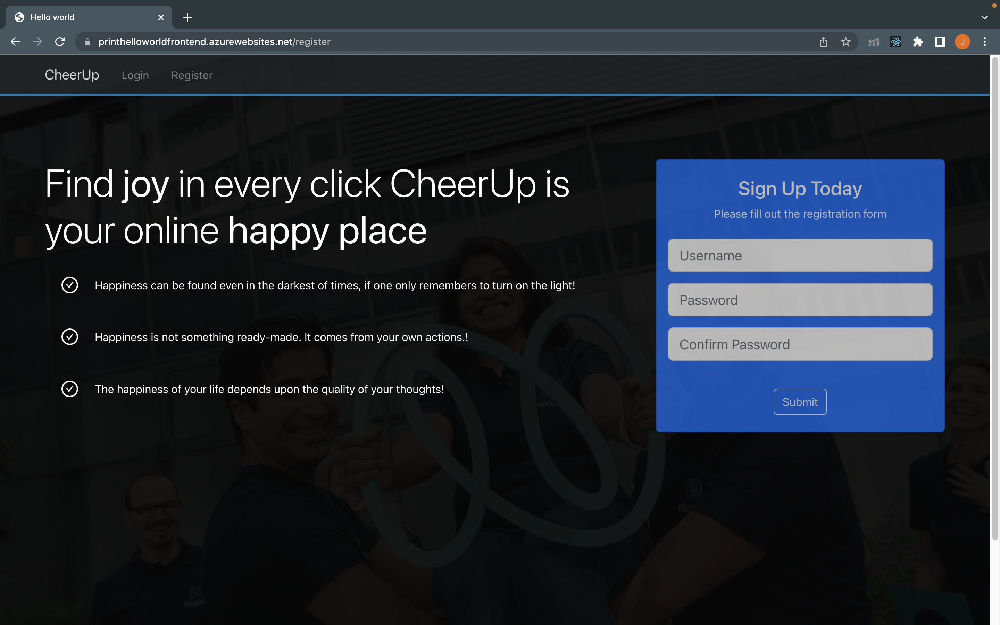
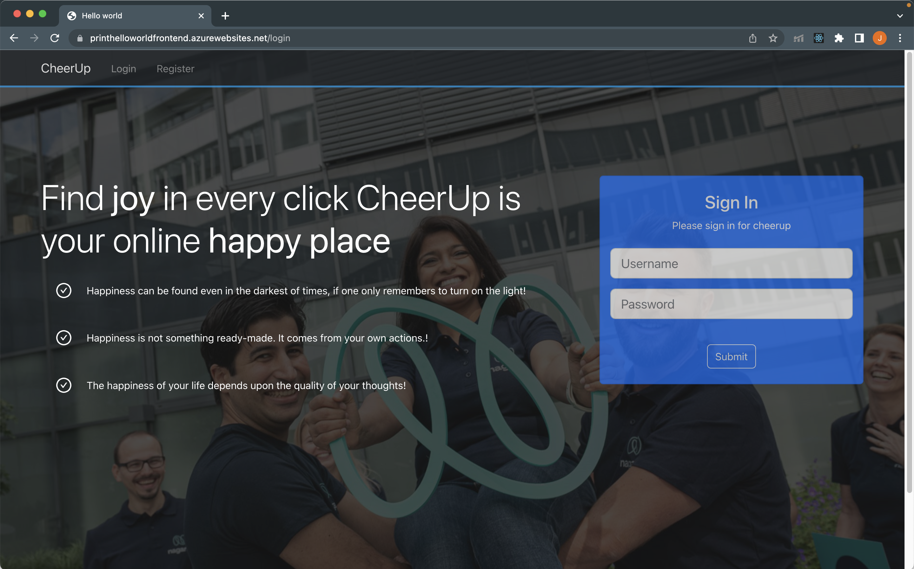
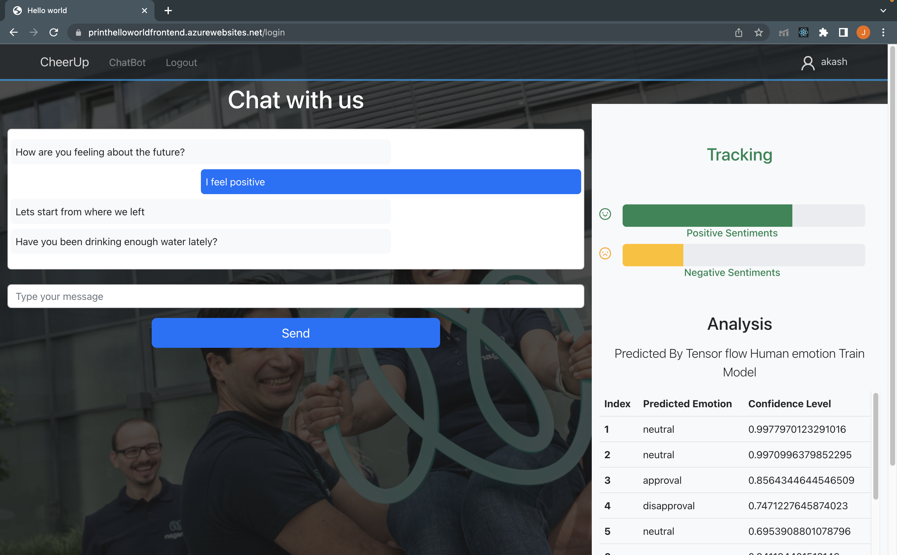

<!-- PROJECT LOGO -->
 

  <a href="https://printhelloworldfrontend.azurewebsites.net/">

  <h3 align="center">print("Hello world")</h3>
</a>
    <h3 align="center">(https://printhelloworldfrontend.azurewebsites.net/)</h3>
  

    Repository to host the code for a cool chatbot that could understand emotions in your replies and respond accordingly.
  

<!-- TABLE OF CONTENTS -->

  
Table of Contents

  <ol>
    <li>
      <a href="#about-the-project">About The Project</a>
      <ul>
        <li><a href="#tech-stack">Tech stack</a></li>
      </ul>
    </li>
    <li>
      <a href="#getting-started">Getting Started</a>
      <ul>
        <li><a href="#prerequisites">Prerequisites</a></li>
        <li><a href="#installation">Installation</a></li>
      </ul>
    </li>
    <li><a href="#roadmap">Roadmap</a></li>
    <li><a href="#contact">Contact</a></li>
    <li><a href="#acknowledgments">Acknowledgments</a></li>
  </ol>
<!-- ABOUT THE PROJECT -->

## About The Project

Aassess a person's emotional state using conversational approach. This is a fully functional chatbot that is ready to use for getting your emotional states up.

If you need to know your emotional state and someone to talk to visit us.

Here's how it works:

- Using a tensor flow to train a model from predicting emotion from personals response.
- Uses 28 different human emotions are used as features to train the model.
- Data set used is GoEmotion dataset provided by Google.
  - The GoEmotions dataset contains 58k carefully curated Reddit comments labeled for 27 emotion categories or Neutral. The raw data is included as well as the smaller, simplified version of the dataset with predefined train/val/test splits.
  - [Location on hugging face](https://huggingface.co/datasets/go_emotions)
  - [Location on Google repository](https://github.com/google-research/google-research/tree/master/goemotions)
- Predicted each emotion on a single sentence by generating confidence level and
  picked the high probability interval one to it's closest.
- \_`Emotions = ["admiration",1"amusement","anger","annoyance","approval","caring","confusion","curiosity","desire","disappointment","disapproval",disgust","embarrassment","excitement","fear","gratitude","grief","joy","love","nervousness","optimism","pride","realization","relief","remorse","sadness","surprise","neutral",]`

## Folder Structure

1. CheerUpChatbotWorker

   - getReponse: This is an azure function that is responsible to get user's text and predict sentiments

2. emotion

   - getEmotions: This is an azure function where we train model.

3. font-end: Putting all the UI components built in react.
4. Server: Putting Api code.

(<a href="#readme-top">back to top</a>)

### Tech Stack

The entire application is on the cloud which gives the benefit of scalability and availability

- [React](https://legacy.reactjs.org/docs/getting-started.html) "To build the Front end of application"
- [Python](https://www.python.org/) "To train the AI model"
- [nodeJs](https://nodejs.org/en) "implement the backend"
- [terafroms](https://www.terraform.io/) "To build the model on goEmotions dataset using RoBERTa "
- [Bootstrap](https://getbootstrap.com/) "Beautify frontend"
- [JQuery](https://jquery.com/) "frontend enhancement"
- [Azure](https://azure.microsoft.com/en-in/) "To host most of the services"
- [HuggingFace](https://huggingface.co/arpanghoshal/EmoRoBERTa) "To host the model 'could not get azure to working :P'"

(<a href="#readme-top">back to top</a>)

<!-- GETTING STARTED -->

## Getting Started

To access the app Navigate to [hello world](https://printhelloworldfrontend.azurewebsites.net/)
Its free registrations (till the sponsorship resource lasts :D)

If you are new you could register yourself here.
 - 

Sign in using newly created credentials
 - 

You can integrate with AI Cheerup chatbot.
 - 

### Prerequisites

    If just want to access the app no prerequisite required
    But to run it locally check out the project.

### Installation

- Front end : easiest to build
  - run `npm start` to run local
  - run ``npm run build` to create a deployable build
    - do a azure web deployment for the generated build on the resource (202303_Hackathon_27/printhelloworldfrontend)
- Back end : consists of azure functions
  - Javascript functions could be executed locally with the help of azure functions extenion resource (202303_Hackathon_27/printhelloworldfrontend)
    - user : create authenticate user
    - status : get update progress of emotional state
    - questions : questionnaire for the bot to understand user better
  - python function could be executed locally with the help of azure functions extenion resource (202303_Hackathon_27/CheerUpChatBot)
    - getResponse : generate the response of bot using the emotion analysis generated via model
  - Database
    cosmose Db :https://printhelloworld.documents.azure.com:443/

(<a href="#readme-top">back to top</a>)

<!-- USAGE EXAMPLES -->

(<a href="#readme-top">back to top</a>)

<!-- ROADMAP -->

## Roadmap

- [x] Create a model for predicting emotions
- [x] Host the model
- [x] Create the front end
- [x] Host the web services
- [x] Track the progress of user
- [ ] Improvements that could be done
  - [ ] Follow up person outside the application
  - [ ] Train the model on the returned dataset
  - [ ] Get feedback from users on emotions analyzed
  - [ ] Improve the Cheering system to include auto-generated jokes/methods

(<a href="#readme-top">back to top</a>)

<!-- CONTACT -->

## Contact

- Rohit pratap - rohit.pratap@nagarro.com
- Jay Jha - jay.jha@nagarro.com
- Pankaj Koche - pankaj.koche@nagarro.com​
- Piyush Arora​ - piyush.arora01@nagarro.com​
- Rupal Jain​ - rupal.jain@nagarro.com​

(<a href="#readme-top">back to top</a>)

<!-- ACKNOWLEDGMENTS -->

## Acknowledgments

Had a lot of help from these resources.

Model : https://huggingface.co/rohitLearning/emotionModel

https://arxiv.org/abs/1907.11692

GoEmotions:  Dataset labelled 58000 Reddit comments with 28 emotions
https://huggingface.co/datasets/go_emotions
